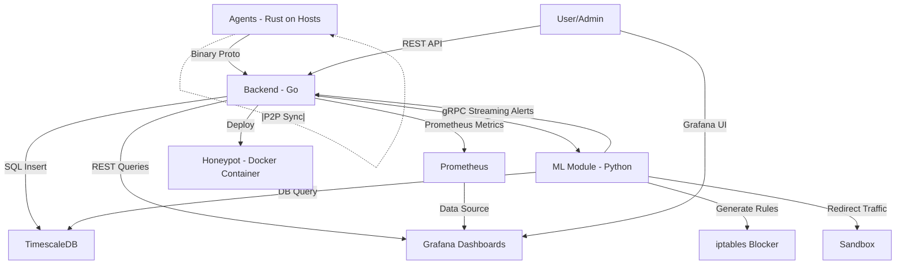

# Архитектура системы

Умная система мониторинга сети — это микросервисное решение для мониторинга локальной сети, анализа трафика и реагирования на угрозы. Диаграмма ниже иллюстрирует архитектуру:

## Узлы (компоненты)

- **A: Agents - Rust on Hosts**: Легковесные агенты на каждом хосте (`Rust`, `eBPF/XDP`). Захватывают пакеты, фильтруют (например, DNS к malware-доменам), сжимают (`zstd`), отправляют метрики (`protobuf`), синхронизируются через Р2Р (`libp2p`). Развёрнуты как DaemonSet B `Kubernetes`.
- **B: Backend - Go**: Центральный сервер. Принимает метрики (`gopacket`), детектирует аномалии, сохраняет в `TimescaleDB`, экспортирует в Prometheus, предоставляет REST API (`grpc-gateway`), управляет honeypot.
- **C: TimescaleDB**: Хранит time-series данные (ІР, порты, объёмы, timestamps).
- **D: Prometheus**: Собирает метрики (объём трафика, аномалии).
- **E: Grafana Dashboards**: Визуализирует топологию, heatmap, 3D-атаки.
- **F: ML Module - Python**: Анализирует трафик (Isolation Forest, Random Forest, ARIMA), генерирует правила для iptables, отправляет алёрты, перенаправляет трафик в песочницу.
- **G: iptables Blocker**: Блокирует угрозы (iptables/netfilter).
- **H: Honeypot - Docker Container**: Ловушка для атакующих (`Cowrie`).
- **I: User/Admin**: Взаимодействует через `Grafana UI` или REST API.
- **J: Sandbox**: Анализирует подозрительный трафик (`Cuckoo Sandbox`).

## Связи (потоки данных)

1. A -->|"Binary Proto"| B: Агенты отправляют сжатые метрики (`protobuf`, `zstd`)по TCP/UDP с ACK/NACK. Пример: SYN-флуд метрики.
2. A -.|P2P Sync|.-> A: P2P-синхронизация (`libp2p`) для обмена метаданными. Пример: обнаружение нового IP.
3. B -->|"SQL Insert"| C: Бэкенд сохраняет метрики в `TimescaleDB`. Пример: запись трафика за минуту.
4. B -->|"Prometheus Metrics"| D: Экспорт метрик в `Prometheus`. Пример: количество аномалий.
5. B -->|"REST Queries"| E: `Grafana` запрашивает данные через REST (`grpc-gateway`). Пример: heatmap трафика
6. B -->|"gRPC"| F: Бэкенд вызывает ML для анализа (`gRPC`, `protobuf`). Пример: проверка на DDoS.
7. F -->|"DB Query"| C: ML тянет данные из `TimescaleDB` (psycopg2). Пример: датасет для обучения.
8. F -->|"Generate Rules"| G: ML генерирует iptables правила (subprocess). Пример: блокировка IP.
9. F -->|"gRPC Streaming Alerts"| B: ML отправляет алёрты в реальном времени (`gRPC streaming`). Пример: "Обнаружен DNS-туннелинг".
10. B -->|"Deploy"| H: Бэкенд деплоит `honeypot` (Docker API). Пример: запуск `Cowrie`.
11. D -->|"Data Source"| E: `Grafana` читает метрики из `Prometheus` (`PromQL`). Пример: график трафика.
12. I -->|"Grafana UI"| E: Админ просматривает дашборды. Пример: анализ топологии.
13. I -->|"REST API"| B: Админ запрашивает данные через REST. Пример: метрики по IP.
14. F -->|"Redirect Traffic"| J: ML перенаправляет трафик в песочницу. Пример: Анализ DNS-запросов.

## Полный путь данных (пример: обнаружение DNS-туннелинга)

1. Агенты (A): Захватывают DNS-запросы (`eBPF/XDP`), фильтруют подозрительные домены, отправляют метрики в бэкенд (`Binary Proto`).
2. P2P Sync (A -.|P2P Sync|.-> A): Агенты синхронизируют данные о доменах через libp2p.
3. Бэкенд (B): Парсит запросы (gopacket), сохраняет в `TimescaleDB` (SQL Insert), экспортирует метрики в `Prometheus`.
4. ML (B --> F): Бэкенд вызывает ML через gRPC для анализа.
5. ML (F): Тянет данные (DB Query), подтверждает DNS-туннелинг (Isolation Forest), генерирует правило для iptables (Generate Rules), отправляет алёрт (gRPC Streaming Alerts), перенаправляет трафик в песочницу (Redirect Traffic).
6. Honeypot (B --> H): Бэкенд деплоит ловушку (Deploy) для анализа атакующего.
7. Визуализация (B/D --> E): Grafana показывает алёрт через REST Queries и Data Source.
8. Админ (I): Видит алёрт в Grafana UI, запрашивает детали через REST API.
