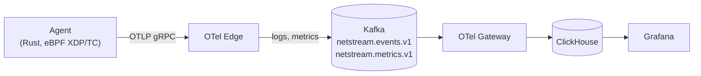
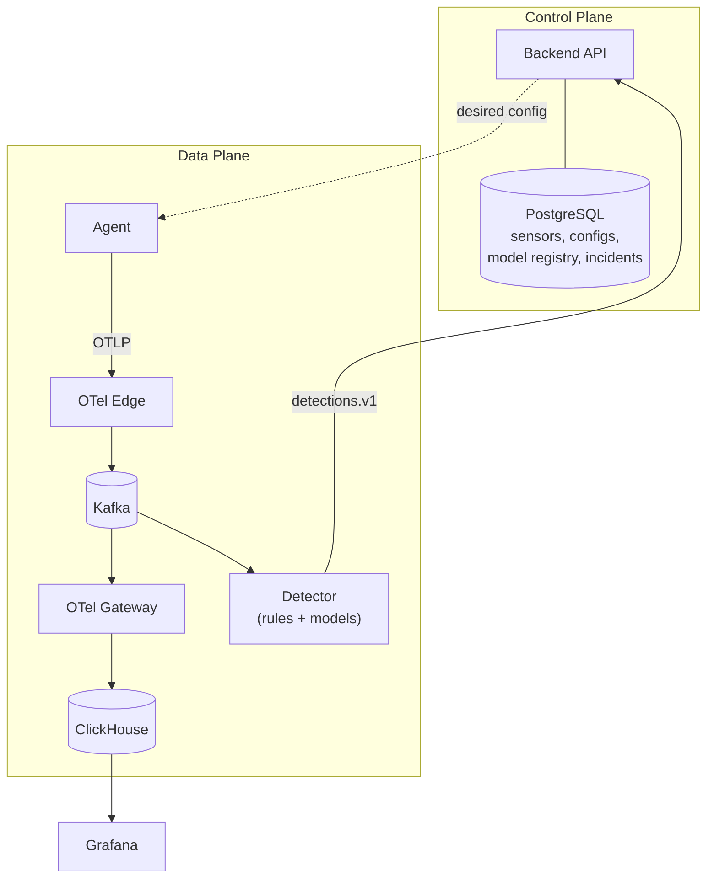

# Архитектура системы

NetStream-Core — система детектирования сетевых атак: eBPF-сенсор на хосте, телеметрия по OTLP через Kafka в ClickHouse, дашборды в Grafana, офлайн-обучение моделей в отдельном ML-конвейере. Ниже — то, что реально построено и работает (data plane), и то, что запланировано следующим шагом (control plane, детектор реального времени). Это два разных раздела, и граница между ними явная: диплом защищается на первом, второе — план, не готовый код.

## Текущая архитектура (data plane)

```mermaid
flowchart LR
    Agent["Agent\n(Rust, eBPF XDP/TC)"] -->|OTLP gRPC| Edge["OTel Edge"]
    Edge -->|logs, metrics| Kafka[("Kafka\nnetstream.events.v1\nnetstream.metrics.v1")]
    Kafka --> Gateway["OTel Gateway"]
    Gateway --> CH[("ClickHouse")]
    CH --> Grafana["Grafana"]
```

### Узлы (компоненты)

- **Agent** (репозиторий `agent`, Rust): XDP-программа на входе и TC-программа на выходе интерфейса разбирают пакеты и DNS-запросы в ядре, агрегируют потоки с бюджетом на новые записи (защита от флуда), проверяют DNS по блок-листу (hot-reload без перезапуска) и по решению отвечают — только наблюдают, дропают запрос или дропают и ставят источник в карантин. Пользовательская часть на Rust периодически снимает счётчики из eBPF-карт и отправляет их по OTLP. eBPF-объект встроен в бинарник агента — разворачивается один файл, без отдельного `.o`.
- **OTel Edge**: приёмник OTLP от агентов, пишет логи и метрики в Kafka. Разделение по сигналам — `netstream.events.v1` (потоки, DNS, срабатывания блоклиста) и `netstream.metrics.v1` (накладные расходы самого агента).
- **Kafka**: буфер и точка развязки между приёмом телеметрии и её хранением — позволяет пережить недоступность ClickHouse без потери данных и, в перспективе, читать тот же поток параллельно чем-то ещё (см. «Целевая архитектура»).
- **OTel Gateway**: читает Kafka, пишет в ClickHouse через `clickhouseexporter`.
- **ClickHouse**: основное телеметрийное хранилище. Сырые OTLP-записи (`otel_logs`, `otel_metrics_*`) живут недолго (TTL 3 дня) и материализованными представлениями превращаются в типизированные таблицы с более долгим хранением: `flows`, `dns_queries`, `blocklist_hits`, агрегаты `flows_1m`, метрики агента `agent_metrics`. Точную схему и историю миграций см. в `deploy/clickhouse/migrations` и `deploy/README.md`.
- **Grafana**: дашборды поверх ClickHouse через read-only учётную запись (не может ничего испортить, даже если кто-то допишет `DROP` в панель).

### Идентичность и время события

Каждое событие несёт `service.instance.id` (`boot_id` — меняется при каждом перезапуске агента), монотонный `netstream.event.sequence` и производный от них `netstream.event.id` — этого достаточно, чтобы отличить повторную доставку одного события (Kafka retry) от нового события, без отдельного генератора UUID. Раздельные `event_time` (когда агент сформировал запись) и `ingest_time` (когда строка попала в ClickHouse, `DEFAULT now()`) отвечают на вопрос «задержка обнаружения — 8 секунд или 800 миллисекунд», который при одной временной оси задать было бы нельзя. Подробности — в `deploy/README.md`, раздел «Идентичность события».

### ML-конвейер (офлайн, отдельно от data plane выше)

Репозиторий `ml` выгружает размеченные данные из ClickHouse (лаборатория `deploy/lab` генерирует атаки и доброкачественный трафик с манифестом кампании), строит оконные признаки по источнику (пакеты, TCP-флаги, распределение размеров, DNS-энтропия и т.д. — одна и та же спецификация в виде быстрого batch-конвейера для обучения и инкрементального аккумулятора для будущего потокового детектора), обучает и честно сравнивает baseline-модели (пороговые правила, Isolation Forest, Random Forest с подбором гиперпараметров) через общий фреймворк оценки (PR-кривые, разброс по seed, тест Макнемара). Всё это работает сегодня и воспроизводимо на реальных данных лаборатории — подробности и текущие числа в `ml/README.md`.

## Целевая архитектура (план, не реализовано)

Следующий шаг — не переписывание текущей системы, а достройка того, чего в ней пока нет: явного control plane, отделённого от data plane, и детектора реального времени, читающего Kafka параллельно ClickHouse, а не после него.

```mermaid
flowchart TB
    subgraph CP["Control Plane"]
        Backend["Backend API"]
        PG[("PostgreSQL\nsensors, configs,\nmodel registry, incidents")]
        Backend --- PG
    end
    subgraph DP["Data Plane"]
        Agent["Agent"] -->|OTLP| Edge["OTel Edge"]
        Edge --> Kafka[("Kafka")]
        Kafka --> Gateway["OTel Gateway"]
        Gateway --> CH[("ClickHouse")]
        Kafka --> Detector["Detector\n(rules + models)"]
    end
    CH --> Grafana["Grafana"]
    Detector -->|detections.v1| Backend
    Backend -.desired config.-> Agent
```

Принцип разделения: **control plane управляет data plane, но не является его частью**. Агент не должен зависеть от backend для работы — если backend недоступен, агент продолжает захват, агрегацию и применение уже полученного (последнего known-good) конфига блок-листа; и наоборот, падение агента не должно останавливать приём и хранение телеметрии от остальных сенсоров.

- **Backend / Control Plane**: реестр сенсоров, desired/actual конфигурация (агент сравнивает версию конфига с локальной и подтягивает разницу, а не применяет команды по одной), реестр моделей (метаданные — метрики, версия признаков, ссылка на артефакт; сам артефакт — на диске/в объектном хранилище, не в базе), инциденты, RBAC. Состояние control plane — в PostgreSQL, а не в ClickHouse: пользователи, права, конфиги и метаданные моделей не пишутся построчно в MergeTree-таблицу, для которой она не предназначена.
- **Detector**: подписан на тот же `netstream.events.v1`, что и OTel Gateway, — независимо от того, успел ли ClickHouse записать событие. ClickHouse в latency-critical пути детектирования не участвует, он остаётся хранилищем для дашбордов и обучения моделей, а не промежуточным звеном между сенсором и алертом.

Пока не в плане (осознанно, не забыто): отдельный сервис Correlation Engine, кластеризация Kafka/ClickHouse, HA-профили, SLO как формальный документ — это архитектура production-эксплуатации, а не то, что нужно для защиты диплома с рабочим замкнутым циклом «детект → блок» на одной машине. Если проект продолжится после защиты как реальный сервис — это отдельный следующий этап, не текущий.
